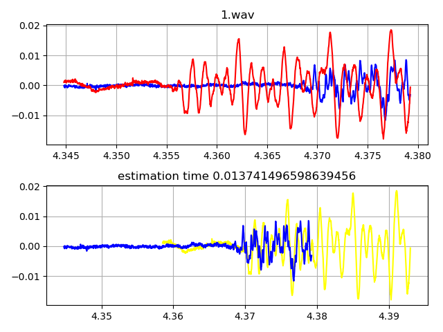

#  Wav Input, Time Difference Estimation Output, Web App    

チャイム音をマイクでステレオ録音したWAVファイルを入力して、L channelとR channelの音の時間差をpythonを使って推定して、その結果画像を表示するFlaskを使ったWeb App。  

## 内容   

tde1.py チャイム音をマイクでステレオ録音しとき、L channelとR channelの音の時間差を推定するためのクラス。  
api_server_trial1.py メインのプログラム。  
sample_wav チャイム音をマイクでステレオ録音したwavファイルのサンプルが入っている。  
uploads　アップロード入力したWAVファイルが入る。  
static/figure 結果画像が入る。推定時間を記述したテキストファイルも入る。  
static/css スタイルシートが入っている。  
templates Jinja2に対応したhtmlファイルが入っている。  
Profile herokuを利用して動作確認するためのファイル。  
requirements.txt herokuを利用して動作確認するためのファイル。  
api_server_trial2.py ajaxの非同期通信を使ったメインのプログラム。  
api_server_trial3py 結果画像をBase64エンコードして返す、アップロード入力と結果画像を消去するメインのプログラム。  

結果画像の例：  
    
  
  
  
## 実験  
  
google colabとFlaskの組み込みサーバーとngorkをつかって動作確認するためのスクリプト
[API_server_trial2.ipynb](https://colab.research.google.com/github/shun60s/time-difference-WebApp/blob/master/API_server_trial2.ipynb)  

google colabとGunicornとngorkをつかって動作確認するためのスクリプト
[API_server_gunicorn_trial2.ipynb](https://colab.research.google.com/github/shun60s/time-difference-WebApp/blob/master/API_server_gunicorn_trial2.ipynb)  

[動作確認用のURL](https://tde1.herokuapp.com/)  

## License    
MIT  

